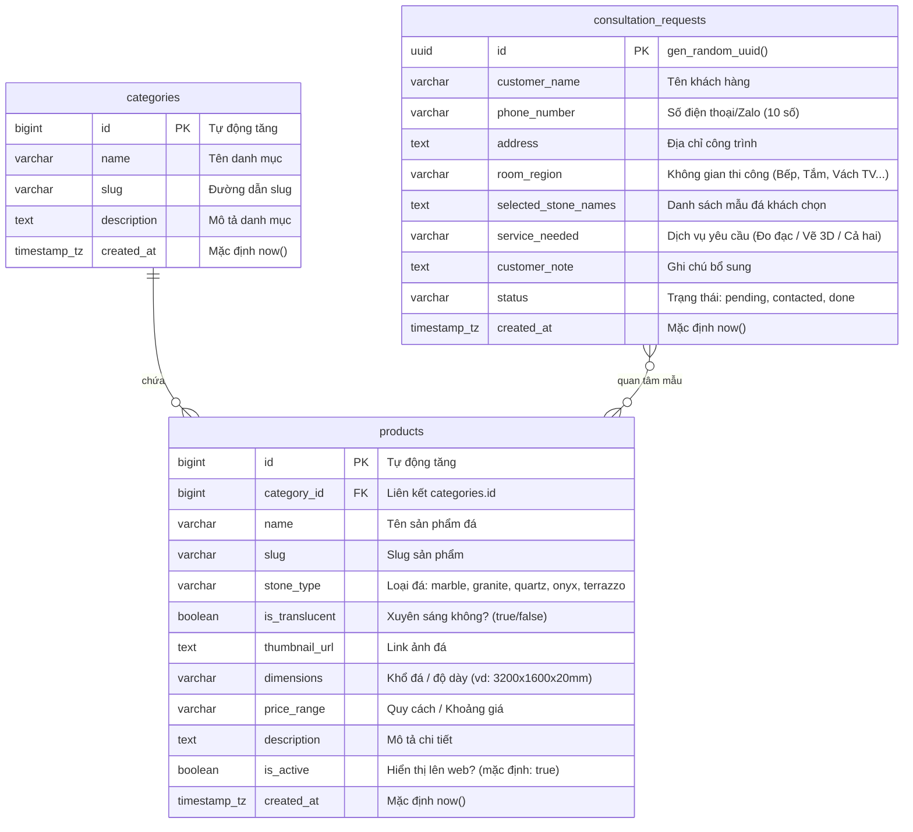

# TUAN CHAU ATELIER - CẤU TRÚC TOÀN BỘ DỰ ÁN & HƯỚNG DẪN KỸ THUẬT (DEVELOPER & AI AGENT GUIDE)

> **MỤC ĐÍCH TÀI LIỆU**: Tài liệu này đóng vai trò là "Bản đồ kiến trúc" (Architecture & Routing Blueprint) của toàn bộ dự án **Tuan Chau Atelier**. Khi AI Agent hoặc Lập trình viên nhận prompt yêu cầu sửa đổi, thêm tính năng, thay đổi giao diện hoặc kết nối API, hãy đọc tài liệu này trước để biết chính xác **App dùng làm gì - Luồng chạy ra sao - Cần sửa ở file nào, dòng nào** mà không làm ảnh hưởng đến các thành phần khác.

---

## 1. TỔNG QUAN DỰ ÁN (CORE PURPOSE & SCOPE)

* **Tên thương hiệu**: **Tuan Chau Atelier**
* **Lĩnh vực hoạt động**: Cung cấp, chế tác và thi công trọn gói các dòng **Gạch Ốp Lát Nghệ Thuật & Đá Tự Nhiên / Đá Thạch Anh Cao Cấp** (Marble Ý, Granite Brazil, Onyx xuyên sáng Iran, Quartz nhân tạo cao cấp, Terrazzo nghệ thuật).
* **Mục tiêu của ứng dụng Web**:
  1. **Trưng bày sản phẩm đẳng cấp**: Giao diện mang phong cách sang trọng (*Luxury Glassmorphism & Marble Theme*), hiển thị trực quan các phiến đá nguyên tấm, đường vân sắc nét kèm kích thước và quy cách.
  2. **Trải nghiệm tương tác sống động**:
     - *Accordion Gallery*: Bộ sưu tập trải rộng ngang dạng thẻ co giãn mượt mà.
     - *Giả lập App AR*: Mô phỏng trải nghiệm quét camera và ốp thử vân đá 3D trên màn hình điện thoại iPhone mockup.
     - *Video Hero Background*: Video tự động phát trên cả desktop và mobile, có nút mở Video Intro Modal xem toàn màn hình.
     - *Dock Filter*: Thanh lọc sản phẩm kiểu Apple Dock hiện đại trên các trang danh mục.
  3. **Phễu chuyển đổi khách hàng tiềm năng (Lead Generation Funnels)**:
     - **Form khảo sát 4 bước (Multi-Step Wizard)**: *Chọn không gian thi công -> Chọn mẫu đá -> Chọn dịch vụ (Đo đạc / Lên bản vẽ 3D) -> Nhập thông tin & SĐT*.
     - **Form báo giá nhanh (Quick Quote Modal)**: Tự động điền tên mẫu đá khi bấm xem từ thẻ sản phẩm.
     - **Form liên hệ chân trang & Form đăng ký Bản tin (Newsletter)**.
     - **Nút Zalo tương tác nổi (Floating CTA Button)**: Kết nối chat tư vấn trực tiếp 24/7.
  4. **Hệ thống dữ liệu & Thông báo tức thì**:
     - Lưu trữ toàn bộ dữ liệu yêu cầu tư vấn vào cơ sở dữ liệu **Supabase (PostgreSQL)** với chế độ dự phòng LocalStorage nếu mất kết nối.
     - Bắn tin nhắn cảnh báo định dạng Markdown về nhóm **Telegram Bot** của xưởng theo thời gian thực để nhân viên gọi lại trong 15 phút.

---

## 2. CÔNG NGHỆ SỬ DỤNG (TECH STACK)

* **Frontend**: HTML5 Semantic, CSS3 (Modern Vanilla CSS với CSS Variables, Glassmorphism, Flexbox/Grid, Responsive Mobile-first), JavaScript (ES6+ Vanilla Modular).
* **Database & BaaS**: **Supabase** (PostgreSQL REST API qua PostgREST, Row Level Security - RLS).
* **Realtime Notification**: **Telegram Bot API** (Endpoint: `https://api.telegram.org/bot<TOKEN>/sendMessage`).
* **State Management**:
  - `localStorage` lưu trữ trạng thái Theme (`color-scheme`: `light` / `dark`).
  - `localStorage` lưu trữ dữ liệu dự phòng (`consultation_requests`) khi offline.
  - Runtime State: Biến toàn cục `window.allProducts`, `window.APP_CONFIG`, `window.SupabaseAPI`, `window.TelegramAPI`.

---

## 3. CẤU TRÚC THƯ MỤC & VAI TRÒ TỪNG FILE (DIRECTORY MAP)

```text
d:\TuanChauAtelier\
├── .env                              # Thông tin môi trường nhạy cảm (Private)
├── .gitignore                        # Cấu hình bỏ qua git
├── README.md                         # Giới thiệu tổng quan repo
├── AGENTS.md                         # Bộ quy tắc cốt lõi dành cho AI Agent
├── APP_STRUCTURE.md                  # [FILE NÀY] Tài liệu kiến trúc toàn diện & Chỉ dẫn sửa code
├── index.html                        # Redirect hoặc file gốc
│
└── landing-page-gach-da/             # THƯ MỤC CHÍNH CỦA DỰ ÁN
    ├── index.html                    # Trang chủ chính (Landing Page hoàn chỉnh)
    ├── da-tu-nhien.html              # Trang danh mục: Đá Tự Nhiên (Marble, Granite, Onyx)
    ├── da-nhan-tao.html              # Trang danh mục: Đá Nhân Tạo (Calacatta Quartz, Storm Quartz...)
    ├── gach-art.html                 # Trang danh mục: Gạch Ốp Lát Art (Gạch bông, Terrazzo, Men rạn...)
    │
    ├── components/                   # Các thành phần HTML tải động (hoặc dự phòng)
    │   ├── header.html               # Header chung (Logo, Menu, Nút Theme, Mobile Toggle)
    │   ├── footer.html               # Footer chung (Thông tin liên hệ, Links, Form Newsletter)
    │   └── app-intro.html            # Khối giới thiệu Ứng dụng AR & Mockup điện thoại
    │
    ├── css/                          # Toàn bộ mã nguồn giao diện & hiệu ứng
    │   ├── style.css                 # CSS trung tâm: Design Tokens, Typography, Layout, Modals, Forms
    │   └── app-intro.css             # CSS chi tiết cho khối giả lập App AR trên smartphone
    │
    ├── js/                           # Toàn bộ mã nguồn Logic JavaScript
    │   ├── config.js                 # Cấu hình Supabase (URL, Anon Key) & Telegram Bot (Token, Chat ID)
    │   ├── main.js                   # Bộ điều khiển TRANG CHỦ (Wizard, Accordion, Modals, Theme, Lightbox)
    │   ├── subpage.js                # Bộ điều khiển TRANG CON (Dock Filter, Swipe gesture, Dynamic Catalog)
    │   ├── app-intro.js              # Bộ giả lập trải nghiệm thay vân đá AR trên màn hình điện thoại
    │   └── api/                      # Thư mục chứa các module kết nối dịch vụ ngoài
    │       ├── supabase.js           # API Service gửi Lead và lấy danh sách sản phẩm
    │       └── telegram.js           # API Service bắn thông báo Telegram Bot
    │
    └── assets/                       # Tài nguyên đa phương tiện
        ├── icons/                    # Icons SVG, Favicons
        ├── images/                   # Hình ảnh sản phẩm đá & gạch
        │   ├── da_tu_nhien/          # Ảnh đá Marble, Granite, Onyx, Patagonia, Carrara, Nero...
        │   ├── da_nhan_tao/          # Ảnh thạch anh nhân tạo Calacatta, Pure White, Storm...
        │   └── gach_art/             # Ảnh gạch bông, men rạn, gạch Terrazzo, Zellige...
        └── videos/                   # Video tư liệu giới thiệu
            ├── thế_đoạn_video_...mp4 # Video nền Hero cho bản Desktop
            └── videomobile/          # Video nền Hero tối ưu cho bản Mobile
```

---

## 4. HỆ THỐNG GIAO DIỆN & DESIGN SYSTEM (CSS VARIABLES)

Tất cả màu sắc, khoảng cách và hiệu ứng được quản lý tập trung trong file [`landing-page-gach-da/css/style.css`](file:///d:/TuanChauAtelier/landing-page-gach-da/css/style.css):

### 4.1. Bảng màu (Color Tokens)

| Token CSS | Light Theme (Mặc định) | Dark Theme (`[data-theme="dark"]`) | Ứng dụng thực tế |
| :--- | :--- | :--- | :--- |
| `--bg-primary` | `#f8fafc` (Trắng xám Carrara) | `#090d16` (Đen đá sâu) | Nền chính của toàn trang web |
| `--bg-secondary` | `#ffffff` (Trắng tinh khiết) | `#111827` (Đen xám than) | Nền thẻ sản phẩm, Card, Modals |
| `--bg-tertiary` | `#f1f5f9` | `#1f2937` | Nền các khối phụ, input form |
| `--text-primary` | `#0f172a` (Slate đậm) | `#f3f4f6` (Trắng xám sáng) | Tiêu đề chính H1, H2, H3, Tên đá |
| `--text-secondary` | `#475569` | `#9ca3af` | Đoạn văn mô tả, nhãn phụ |
| `--accent-gold` | `#c5a880` (Vàng champagne) | `#d4af37` (Vàng kim loại sáng) | Đường viền nhấn, Icon, nút chính |
| `--accent-bronze` | `#8c6d4f` (Nâu đồng ấm) | `#a18262` | Subtitle, nhãn danh mục |
| `--border-color` | `#e2e8f0` | `#374151` | Đường kẻ khung, viền card |
| `--glass-bg` | `rgba(255, 255, 255, 0.75)` | `rgba(17, 24, 39, 0.75)` | Hiệu ứng kính mờ (Backdrop filter) |

### 4.2. Typography & Nút bấm (Buttons)
* **Font Serif**: `'Playfair Display', Georgia, serif` (Dùng cho Tiêu đề lớn, tên thương hiệu tạo cảm giác cổ điển quý phái).
* **Font Sans**: `'Outfit', system-ui, sans-serif` (Dùng cho nội dung, thông số, nhãn nút).
* **Nút bấm chính (`.btn-primary`)**:
  - *Light Theme*: Nền `#160f06` (Nâu đen đậm), chữ vàng gold `#c5a880`.
  - *Dark Theme*: Nền `#d4af37` (Vàng kim), chữ `#110a04` (Đen nâu).
* **Nút bấm phụ (`.btn-secondary`)**: Nền trong suốt, viền và chữ theo màu theme tương ứng, hover đảo màu.

---

## 5. CƠ SỞ DỮ LIỆU & LUỒNG DỮ LIỆU (DATABASE & API FLOW)

### 5.1. Sơ đồ cơ sở dữ liệu Supabase (PostgreSQL Schema)



### 5.2. Luồng xử lý dữ liệu (Data Pipeline Flow)

1. **Hiển thị sản phẩm (Catalog Read Flow)**:
   - Client gọi `window.SupabaseAPI.fetchProductsFromSupabase()`.
   - Hàm `normalizeStoneType()` chuẩn hóa thể loại về: `marble`, `granite`, `quartz`, `onyx`, `terrazzo`, `men-ran`, `bong`, `zellige`.
   - Nếu Supabase trống hoặc lỗi mạng: Tự động kích hoạt danh sách sản phẩm dự phòng `FALLBACK_PRODUCTS` (trang chủ) hoặc `SUBPAGE_FALLBACKS` (trang con) để đảm bảo trang web **luôn hoạt động mượt mà 100% không bao giờ bị trắng trang**.
2. **Gửi thông tin khách hàng (Lead Ingestion Flow)**:
   - Khách hoàn tất form (Khảo sát 4 bước / Báo giá nhanh / Chân trang).
   - Kiểm tra định dạng số điện thoại Việt Nam (`validatePhone()`: 10 chữ số).
   - Gọi `window.SupabaseAPI.sendToSupabase(payload)` -> Lưu vào bảng `consultation_requests` (nếu lỗi -> lưu `localStorage`).
   - Gọi `window.TelegramAPI.sendTelegramAlert(payload)` -> Bắn tin nhắn Markdown tức thì tới nhóm Telegram của xưởng.
   - Hiển thị màn hình thành công và tự động đếm ngược 5 giây đóng form.

---

## 6. HƯỚNG DẪN ĐỊNH TUYẾN SỬA ĐỔI (QUICK DEVELOPER & AI ROUTING CHEATSHEET)

Khi nhận yêu cầu chỉnh sửa, hãy tra cứu bảng dưới đây để mở đúng file và vị trí cần làm việc:

| Nhiệm vụ cần làm | File cần mở | Vị trí / Tên hàm / Class cụ thể |
| :--- | :--- | :--- |
| **Thay đổi URL Supabase, Anon Key, Telegram Token, Chat ID** | [`js/config.js`](file:///d:/TuanChauAtelier/landing-page-gach-da/js/config.js) | Đối tượng `window.APP_CONFIG` |
| **Sửa màu sắc, Dark/Light theme, Font chữ, Bo góc** | [`css/style.css`](file:///d:/TuanChauAtelier/landing-page-gach-da/css/style.css) | Khối `:root` (Line 9) & `[data-theme="dark"]` (Line 47) |
| **Thêm / Sửa mẫu đá trong Bộ sưu tập Accordion trang chủ** | [`index.html`](file:///d:/TuanChauAtelier/landing-page-gach-da/index.html) | Section `#catalog` -> Khối `.accordion-container` (Line 160) |
| **Sửa danh sách đá gợi ý ở Step 2 của Form Khảo sát (Wizard)** | [`js/main.js`](file:///d:/TuanChauAtelier/landing-page-gach-da/js/main.js) | Biến `STONE_DATABASE` (Line 572) |
| **Sửa logic chuyển bước & validation của Form Khảo sát** | [`js/main.js`](file:///d:/TuanChauAtelier/landing-page-gach-da/js/main.js) | Hàm `initConsultationMultiStep()` (Line 607) |
| **Sửa HTML các bước khảo sát (Không gian, Dịch vụ, Liên hệ)** | [`index.html`](file:///d:/TuanChauAtelier/landing-page-gach-da/index.html) | Modal `#consultationModal` (Line 554 - 720) |
| **Sửa sản phẩm tĩnh dự phòng (Fallback) trang chủ** | [`js/main.js`](file:///d:/TuanChauAtelier/landing-page-gach-da/js/main.js) | Biến `FALLBACK_PRODUCTS` (Line 1022) |
| **Sửa sản phẩm tĩnh dự phòng (Fallback) các trang con** | [`js/subpage.js`](file:///d:/TuanChauAtelier/landing-page-gach-da/js/subpage.js) | Biến `SUBPAGE_FALLBACKS` (Line 57) |
| **Sửa thanh Dock Filter & Lọc sản phẩm ở trang con** | [`js/subpage.js`](file:///d:/TuanChauAtelier/landing-page-gach-da/js/subpage.js) | Hàm `initSubpageFilterTabs()` (Line 250) |
| **Sửa giao diện / hiệu ứng màn hình mô phỏng AR trên điện thoại** | [`css/app-intro.css`](file:///d:/TuanChauAtelier/landing-page-gach-da/css/app-intro.css) | Khối `.phone-device-container`, `.app-tile-thumb` |
| **Sửa logic bấm chọn vân đá trên màn hình mô phỏng AR** | [`js/app-intro.js`](file:///d:/TuanChauAtelier/landing-page-gach-da/js/app-intro.js) | Hàm `window.initAppIntroSimulator` |
| **Sửa Video nền Hero hoặc nút Video Modal** | [`index.html`](file:///d:/TuanChauAtelier/landing-page-gach-da/index.html) | Khối `.hero-video-backdrop` & Modal `#videoModal` |
| **Sửa số điện thoại Zalo, link liên hệ nổi** | [`index.html`](file:///d:/TuanChauAtelier/landing-page-gach-da/index.html) | Nút `#floatingCtaBtn` & `.btn-nav-cta` (`https://zalo.me/...`) |
| **Sửa cấu trúc nội dung tin nhắn Telegram gửi về Admin** | [`js/api/telegram.js`](file:///d:/TuanChauAtelier/landing-page-gach-da/js/api/telegram.js) | Biến `text` trong hàm `sendTelegramAlert()` |
| **Sửa cấu trúc lưu dữ liệu Supabase / LocalStorage** | [`js/api/supabase.js`](file:///d:/TuanChauAtelier/landing-page-gach-da/js/api/supabase.js) | Hàm `sendToSupabase()` và `fetchProductsFromSupabase()` |

---

## 7. CÁC NGUYÊN TẮC BẮT BUỘC DÀNH CHO AI AGENT (AGENT INSTRUCTIONS)

1. **Tuân thủ phân cấp file**: 
   - Mã nguồn chính nằm trong thư mục `landing-page-gach-da/`. 
   - Không tự ý tạo các file CSS/JS thừa thãi ở thư mục gốc. Mọi logic mới cần đặt đúng vào `js/` hoặc `css/`.
2. **Không phá vỡ Design Tokens**: 
   - Tuyệt đối không hardcode mã màu lung tung (như `red`, `blue`, `#333`). Phải luôn dùng `var(--bg-primary)`, `var(--text-primary)`, `var(--accent-gold)`, v.v.
3. **Giữ cơ chế Fallback an toàn**: 
   - Mọi hàm gọi API bên ngoài (Supabase/Telegram) đều phải bọc trong `try...catch` và có phương án Fallback (LocalStorage / Fallback Data) để trang web luôn hiển thị hoàn hảo ngay cả khi chạy ở môi trường offline hoặc chưa cấu hình API.
4. **Không tự ý mở Browser Subagent**: 
   - Trừ khi người dùng yêu cầu rõ ràng, AI không tự khởi chạy browser subagent để kiểm tra nhằm tiết kiệm thời gian phản hồi cho người dùng.
5. **Hỗ trợ chạy Offline và Local Server**:
   - Code hỗ trợ cả giao thức `file://` (mở trực tiếp file HTML) lẫn `http://` (Live Server / Node / Nginx). Hãy duy trì tính tương thích này.
