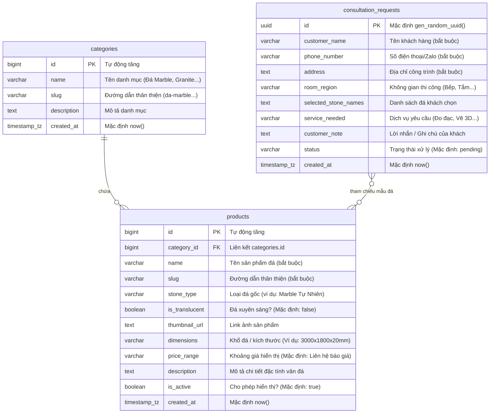

# TUAN CHAU ATELIER - CẤU TRÚC ỨNG DỤNG & THIẾT KẾ CƠ SỞ DỮ LIỆU

Tài liệu này mô tả mục đích của ứng dụng, cấu trúc mã nguồn hiện tại và cung cấp hướng dẫn thiết kế cơ sở dữ liệu chi tiết để đồng bộ hóa hoàn hảo với tính năng của trang web.

---

## 1. Mục Đích Của Ứng Dụng (App Purpose)

**Tuan Chau Atelier** là một trang Landing Page giới thiệu và kinh doanh các sản phẩm gạch ốp lát nghệ thuật, đá tự nhiên cao cấp (Marble, Granite, Onyx, Quartz, Terrazzo). 

Mục tiêu cốt lõi của ứng dụng bao gồm:
1. **Trưng bày sản phẩm (Product Showcase)**: Hiển thị bộ sưu tập sản phẩm đá kèm theo hình ảnh chất lượng cao, kích thước, mô tả và khoảng giá để khách hàng tham khảo.
2. **Bộ lọc thông minh (Interactive Filter)**: Cho phép khách lọc sản phẩm theo loại đá để tìm kiếm nhanh chóng.
3. **Phễu thu thập khách hàng tiềm năng (Lead Generation Funnel)**:
   - **Form liên hệ chân trang**: Khách yêu cầu tư vấn nhanh qua SĐT.
   - **Form báo giá nhanh trong Modal**: Khách xem sản phẩm cụ thể và bấm yêu cầu báo giá chi tiết cho sản phẩm đó.
   - **Form khảo sát nhiều bước (Multi-Step Consultation Wizard)**: Một phễu khảo sát trải nghiệm cao giúp khách tự chọn: *Không gian thi công (Bếp, Tắm, Vách TV...) -> Mẫu đá ưng ý -> Nhu cầu dịch vụ (Đo đạc thực tế hay Lên bản vẽ 3D) -> Nhập thông tin liên hệ*.
4. **Hệ thống phản hồi tức thì (Instant Notification)**: Lưu thông tin khách hàng vào cơ sở dữ liệu Supabase đồng thời bắn tin nhắn cảnh báo qua Telegram Bot để nhân viên liên hệ lại ngay trong vòng 15 phút.

---

## 2. Cấu Trúc Thư Mục & Tệp Tin (App File Structure)

```text
TuanChauAtelier/
├── landing-page-gach-da/
│   ├── index.html          # Trang giao diện chính (chứa bố cục & các Modal biểu mẫu)
│   ├── .env                # Lưu thông tin nhạy cảm kết nối API (không commit Git)
│   ├── assets/             # Chứa hình ảnh, biểu tượng sản phẩm và tài nguyên tĩnh
│   ├── components/         # Các tệp HTML thành phần tải động (Header, Footer, App Intro)
│   ├── css/
│   │   ├── style.css       # File định dạng giao diện chính, màu sắc (Light/Dark), responsive
│   │   └── app-intro.css   # Định dạng giao diện màn hình Intro Splash và Simulator
│   └── js/
│       ├── config.js       # File cấu hình kết nối Supabase Client (Anon Key) và Telegram
│       ├── app-intro.js    # Logic giả lập giao diện trải nghiệm ứng dụng di động
│       └── main.js         # File chứa toàn bộ logic tương tác chính (Bộ lọc, Modal, Gọi API)
├── .gitignore              # Chỉ định các tệp Git cần bỏ qua (ví dụ: .env, node_modules)
├── README.md               # Hướng dẫn chạy dự án sơ bộ
└── APP_STRUCTURE.md        # Tài liệu cấu trúc ứng dụng và thiết kế database (File này)
```

---

## 3. Thiết Kế Cơ Sở Dữ Liệu Chi Tiết (Database Schema Design)

Dựa trên cấu trúc dữ liệu ứng dụng đang đọc và ghi, cơ sở dữ liệu trên Supabase (PostgreSQL) được thiết kế gồm **3 bảng chính**: `categories`, `products` và `consultation_requests`.



### Bảng 1: `categories` (Danh mục sản phẩm)
Bảng này dùng để quản lý các nhóm đá cốt lõi trên trang web (giúp mở rộng quy mô sản phẩm sau này).
- **SQL Tạo bảng**:
  ```sql
  CREATE TABLE public.categories (
      id bigint GENERATED BY DEFAULT AS IDENTITY PRIMARY KEY,
      name character varying(255) NOT NULL,
      slug character varying(255) NOT NULL UNIQUE,
      description text,
      created_at timestamp with time zone DEFAULT now()
  );
  ```

### Bảng 2: `products` (Danh sách sản phẩm đá)
Bảng lưu trữ thông tin sản phẩm hiển thị trên Catalog trang web.
- **SQL Tạo bảng**:
  ```sql
  CREATE TABLE public.products (
      id bigint GENERATED BY DEFAULT AS IDENTITY PRIMARY KEY,
      category_id bigint REFERENCES public.categories(id) ON DELETE SET NULL,
      name character varying(255) NOT NULL,
      slug character varying(255) NOT NULL UNIQUE,
      stone_type character varying(100),
      is_translucent boolean DEFAULT false,
      thumbnail_url text,
      dimensions character varying(100),
      price_range character varying(100) DEFAULT 'Liên hệ báo giá'::character varying,
      description text,
      is_active boolean DEFAULT true,
      created_at timestamp with time zone DEFAULT now()
  );
  ```
- **Chính sách phân quyền (RLS Policy)**: Khách vãng lai cần được quyền đọc bảng này để hiển thị trên web.
  ```sql
  ALTER TABLE public.products ENABLE ROW LEVEL SECURITY;
  CREATE POLICY "Allow public select" ON public.products FOR SELECT TO anon USING (true);
  ```

### Bảng 3: `consultation_requests` (Yêu cầu tư vấn & Khảo sát)
Bảng lưu trữ data khách hàng để nhân viên liên hệ tư vấn và chốt lịch đo đạc.
- **SQL Tạo bảng**:
  ```sql
  CREATE TABLE public.consultation_requests (
      id uuid DEFAULT gen_random_uuid() PRIMARY KEY,
      customer_name character varying(255) NOT NULL,
      phone_number character varying(20) NOT NULL,
      address text NOT NULL,
      room_region character varying(100),
      selected_stone_names text,
      service_needed character varying(100),
      customer_note text,
      status character varying(50) DEFAULT 'pending'::character varying,
      created_at timestamp with time zone DEFAULT now()
  );
  ```
- **Chính sách phân quyền (RLS Policy)**: Khách vãng lai cần được quyền ghi (INSERT) để gửi form từ trình duyệt, nhưng không được quyền xem (SELECT) dữ liệu của khách khác để bảo mật thông tin.
  ```sql
  ALTER TABLE public.consultation_requests ENABLE ROW LEVEL SECURITY;
  CREATE POLICY "Allow public insert" ON public.consultation_requests FOR INSERT TO anon WITH CHECK (true);
  ```

---

## 4. Quy Trình Luồng Dữ Liệu (Data Flow)

1. **Hiển thị sản phẩm**: Trình duyệt gửi request `GET` đến bảng `products` -> Nhận danh sách đá -> Hàm `normalizeStoneType()` trong JS chuyển `stone_type` từ tiếng Việt (ví dụ: `Marble Tự Nhiên`) thành slug tiếng Anh (`marble`) -> Render thẻ sản phẩm và kích hoạt bộ lọc tương ứng.
2. **Khách gửi yêu cầu**: Khách điền thông tin vào 1 trong 3 form trên giao diện -> Javascript kiểm tra tính hợp lệ của SĐT -> Trình duyệt gửi request `POST` lưu dữ liệu vào bảng `consultation_requests` -> Nếu lưu thành công, JS gửi yêu cầu gọi API đến Telegram Bot để bắn thông báo dạng Markdown cho chủ xưởng.
