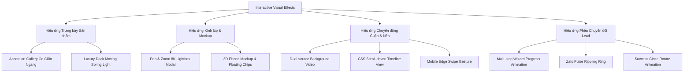

# TUAN CHAU ATELIER - CẨM NANG KỸ THUẬT: THANH TAG & BỘ SƯU TẬP HIỆU ỨNG WEB (SKILLS & EFFECTS MANUAL)

Tài liệu này tổng hợp toàn bộ **Thanh Tag (Dock Filter / Tag Systems)** và **Tất cả hiệu ứng thị giác, chuyển động & tương tác (Visual Effects & Interactive Animations)** được xây dựng trong dự án **Tuan Chau Atelier**. Bạn có thể dùng tài liệu này như một cẩm nang kỹ thuật (Technical Cheatsheet) để tra cứu, bảo trì, tùy biến hoặc tái sử dụng cho các dự án web cao cấp khác.

---

## MỤC LỤC
1. [Hệ Thống Thanh Tag & Bộ Lọc (Tag Bars & Filter Systems)](#1-hệ-thống-thanh-tag--bộ-lọc-tag-bars--filter-systems)
   - [1.1. Luxury Illuminated Dock Filter (Thanh Dock Lọc Đèn Lướt)](#11-luxury-illuminated-dock-filter-thanh-dock-lọc-đèn-lướt)
   - [1.2. Product Origin Badges (Tag Xuất Xứ & Loại Đá)](#12-product-origin-badges-tag-xuất-xứ--loại-đá)
   - [1.3. Interactive Region / Space Tags (Thẻ Tag Chọn Không Gian)](#13-interactive-region--space-tags-thẻ-tag-chọn-không-gian)
   - [1.4. Stone Selection Tags (Thẻ Tag Chọn Mẫu Đá)](#14-stone-selection-tags-thẻ-tag-chọn-mẫu-đá)
   - [1.5. Service Option Tags (Thẻ Tag Chọn Dịch Vụ)](#15-service-option-tags-thẻ-tag-chọn-dịch-vụ)
   - [1.6. AR Material Selector Tags (Tag Chọn Vân Đá Thử Nghiệm)](#16-ar-material-selector-tags-tag-chọn-vân-đá-thử-nghiệm)
   - [1.7. App Store & Google Play Badges (Tag Tải Ứng Dụng)](#17-app-store--google-play-badges-tag-tải-ứng-dụng)
2. [Hệ Thống Hiệu Ứng Chuyển Động & Tương Tác (Effects & Animations)](#2-hệ-thống-hiệu-ứng-chuyển-động--tương-tác-effects--animations)
   - [2.1. Horizontal Expanding Accordion Gallery (Thư Viện Co Giãn Ngang)](#21-horizontal-expanding-accordion-gallery-thư-viện-co-giãn-ngang)
   - [2.2. Luxury Zoomable Lightbox (Siêu Phóng To & Kéo Rê Vân Đá 8K)](#22-luxury-zoomable-lightbox-siêu-phóng-to--kéo-rê-vân-đá-8k)
   - [2.3. 3D Smartphone Frame & AR Simulator (Giả Lập App Thực Tế Ảo)](#23-3d-smartphone-frame--ar-simulator-giả-lập-app-thực-tế-ảo)
   - [2.4. Floating Zalo CTA & Pulse Ring (Nút Gọi Sóng Nước Lan Tỏa)](#24-floating-zalo-cta--pulse-ring-nút-gọi-sóng-nước-lan-tỏa)
   - [2.5. Dual-Track Hero Video & Fullscreen Modal (Video Nền Kép)](#25-dual-track-hero-video--fullscreen-modal-video-nền-kép)
   - [2.6. Modern Scroll-Driven & Reveal Animations (Xuất Hiện Khi Cuộn)](#26-modern-scroll-driven--reveal-animations-xuất-hiện-khi-cuộn)
   - [2.7. Smooth Theme Switcher & FOUC Prevention (Đổi Giao Diện Sáng/Tối)](#27-smooth-theme-switcher--fouc-prevention-đổi-giao-diện-sángtối)
   - [2.8. Mobile Edge Swipe Gesture (Vuốt Mép Quay Về Trang Chủ)](#28-mobile-edge-swipe-gesture-vuốt-mép-quay-về-trang-chủ)
   - [2.9. Multi-Step Wizard & Success Animation (Form Khảo Sát Tiến Trình)](#29-multi-step-wizard--success-animation-form-khảo-sát-tiến-trình)
3. [Bảng Tra Cứu Toàn Bộ Keyframes & Design Tokens](#3-bảng-tra-cứu-toàn-bộ-keyframes--design-tokens)
4. [Hướng Dẫn Tái Sử Dụng & Mở Rộng (Reusability Guide)](#4-hướng-dẫn-tái-sử-dụng--mở-rộng-reusability-guide)
5. [Mã Nguồn Trọn Gói (Plug-and-Play) Thanh Dock Filter Cho Web CV / Portfolio](#5-mã-nguồn-trọn-gói-plug-and-play-thanh-dock-filter-cho-web-cv--portfolio)
   - [5.1. File HTML (Cấu trúc thanh Dock cho CV)](#51-file-html-cấu-trúc-thanh-dock-cho-cv)
   - [5.2. File CSS (Hiệu ứng Liquid Glass & Chuyển động lò xo)](#52-file-css-hiệu-ứng-liquid-glass--chuyển-động-lò-xo)
   - [5.3. File JavaScript (Bộ não điều khiển vệt sáng & Lọc dự án)](#53-file-javascript-bộ-não-điều-khiển-vệt-sáng--lọc-dự-án)
   - [5.4. Bản Demo Độc Lập Hoàn Chỉnh](#54-bản-demo-độc-lập-hoàn-chỉnh-chỉ-cần-lưu-và-mở-bằng-trình-duyệt)

---

## 1. HỆ THỐNG THANH TAG & BỘ LỌC (TAG BARS & FILTER SYSTEMS)

### 1.1. Luxury Illuminated Dock Filter (Thanh Dock Lọc Đèn Lướt)
* **Vị trí áp dụng**: Các trang danh mục [`da-tu-nhien.html`](file:///d:/TuanChauAtelier/landing-page-gach-da/da-tu-nhien.html), [`da-nhan-tao.html`](file:///d:/TuanChauAtelier/landing-page-gach-da/da-nhan-tao.html), [`gach-art.html`](file:///d:/TuanChauAtelier/landing-page-gach-da/gach-art.html).
* **Mã nguồn CSS**: [`landing-page-gach-da/css/style.css:L709-L865`](file:///d:/TuanChauAtelier/landing-page-gach-da/css/style.css#L709-L865).
* **Mã nguồn JS**: [`landing-page-gach-da/js/subpage.js:L458-L542`](file:///d:/TuanChauAtelier/landing-page-gach-da/js/subpage.js#L458-L542).

#### A. Cảm hứng & Nguyên lý thiết kế:
* Lấy cảm hứng từ thanh Dock nổi tiếng của Apple macOS kết hợp hiệu ứng **Spring Light Gliding** (Đèn rọi co giãn lò xo).
* Thanh dock nằm lơ lửng (Floating Dock) ở trung tâm trang, sử dụng hiệu ứng kính mờ cao cấp (`backdrop-filter: blur(20px)`), bo tròn dạng viên thuốc cong mềm mại (`border-radius: 50px`) với viền ánh kim Champagne Gold tinh tế.
* Có một **vệt sáng chuyển động** (`.dock-light-indicator`) chạy mượt mà bên dưới các nút. Khi rê chuột (hover) qua nút nào, vệt sáng lập tức lướt tới và tự động co giãn kích thước bằng đúng nút đó. Khi rời chuột (mouseleave), đèn tự động trở về nút đang được chọn (`.active`).

#### B. Cấu trúc HTML mẫu:
```html
<div class="filters-bar-wrapper">
  <div class="portfolio-filters luxury-dock-filter" role="tablist">
    <!-- Vệt sáng chuyển động lò xo -->
    <div class="dock-light-indicator" id="dockIndicator"></div>
    
    <!-- Các nút lọc tag -->
    <button class="filter-btn sub-filter-btn active" data-filter="all" role="tab" aria-selected="true">
      <svg class="dock-icon" viewBox="0 0 24 24" fill="none" stroke="currentColor" stroke-width="1.6">
        <path d="...icon SVG..."/>
      </svg>
      <span>Tất cả</span>
    </button>
    <button class="filter-btn sub-filter-btn" data-filter="marble" role="tab" aria-selected="false">
      <svg class="dock-icon" viewBox="0 0 24 24" fill="none" stroke="currentColor" stroke-width="1.6">
        <path d="...icon SVG..."/>
      </svg>
      <span>Đá Marble Ý</span>
    </button>
    <!-- Thêm các tag khác tùy ý... -->
  </div>
</div>
```

#### C. Quy chuẩn CSS cốt lõi:
```css
/* Khung Dock kính mờ */
.luxury-dock-filter {
  position: relative;
  display: inline-flex;
  align-items: center;
  gap: 6px;
  margin: 0 auto;
  padding: 6px 8px;
  background: rgba(15, 23, 42, 0.88);
  backdrop-filter: blur(20px);
  -webkit-backdrop-filter: blur(20px);
  border: 1px solid rgba(197, 168, 128, 0.35);
  border-radius: 50px;
  box-shadow: 0 16px 40px rgba(0, 0, 0, 0.35), inset 0 1px 0 rgba(255, 255, 255, 0.12);
  width: fit-content;
  max-width: 100%;
  z-index: 10;
}

/* Light Theme tương phản */
[data-theme="light"] .luxury-dock-filter {
  background: rgba(255, 255, 255, 0.94);
  border-color: rgba(197, 168, 128, 0.45);
  box-shadow: 0 14px 35px rgba(15, 23, 42, 0.08), inset 0 1px 0 rgba(255, 255, 255, 0.95);
}

/* Vệt sáng co giãn lò xo (Spring Light Indicator) */
.dock-light-indicator {
  position: absolute;
  top: 0;
  left: 0;
  pointer-events: none;
  border-radius: 40px;
  background: linear-gradient(135deg, rgba(212, 175, 55, 0.22) 0%, rgba(197, 168, 128, 0.12) 100%);
  border: 1.5px solid var(--accent-gold);
  box-shadow: 0 0 20px rgba(212, 175, 55, 0.45), inset 0 0 10px rgba(212, 175, 55, 0.2);
  transition: transform 0.35s cubic-bezier(0.34, 1.56, 0.64, 1),
              width 0.35s cubic-bezier(0.34, 1.56, 0.64, 1),
              height 0.35s ease,
              opacity 0.3s ease;
  z-index: 1;
  opacity: 0;
}
```

#### D. Thuật toán JavaScript điều khiển vệt sáng:
```javascript
function updateIndicator(targetBtn, isInitial = false) {
  if (!dock || !indicator || !targetBtn) return;

  // Lấy chính xác tọa độ và kích thước tương đối của button trong dock
  const left = targetBtn.offsetLeft;
  const top = targetBtn.offsetTop;
  const width = targetBtn.offsetWidth;
  const height = targetBtn.offsetHeight;

  if (isInitial) {
    indicator.style.transition = 'none'; // Tắt transition khi nạp lần đầu để tránh nhấp nháy
    indicator.style.transform = `translate3d(${left}px, ${top}px, 0)`;
    indicator.style.width = `${width}px`;
    indicator.style.height = `${height}px`;
    indicator.style.opacity = '1';
    requestAnimationFrame(() => {
      indicator.style.transition = 'transform 0.45s cubic-bezier(0.34, 1.56, 0.64, 1), width 0.4s cubic-bezier(0.34, 1.56, 0.64, 1), opacity 0.3s ease';
    });
  } else {
    // Di chuyển mượt mà theo gia tốc lò xo (cubic-bezier)
    indicator.style.transform = `translate3d(${left}px, ${top}px, 0)`;
    indicator.style.width = `${width}px`;
    indicator.style.height = `${height}px`;
    indicator.style.opacity = '1';
  }
}
```

#### E. Tối ưu trải nghiệm Mobile (Touch & Horizontal Scroll):
* Bọc `.luxury-dock-filter` trong container `.filters-bar-wrapper` có `overflow-x: auto` và ẩn scrollbar (`scrollbar-width: none`).
* Khi người dùng bấm vào một tag trên di động, tag đó sẽ tự động cuộn mượt vào chính giữa màn hình:
  ```javascript
  btn.scrollIntoView({ behavior: 'smooth', block: 'nearest', inline: 'center' });
  ```

---

### 1.2. Product Origin Badges (Tag Xuất Xứ & Loại Đá)
* **Vị trí áp dụng**: Góc trên các thẻ sản phẩm trong Catalog ([`style.css:L950`](file:///d:/TuanChauAtelier/landing-page-gach-da/css/style.css#L950)).
* **Đặc tính giao diện**:
  - Dạng nhãn pill nhỏ gọn (`font-size: 0.75rem`, `border-radius: 20px`).
  - Nền kính mờ bán trong suốt `rgba(15, 23, 42, 0.75)` trên nền ảnh đá, viền vàng gold mảnh `1px solid rgba(197, 168, 128, 0.4)`.
  - Hiển thị nguồn gốc nguyên phiến: `"Ý"`, `"Brazil"`, `"Tây Ban Nha"`, `"Iran"`.
  - Giúp khách hàng phân biệt nhanh chủng loại cao cấp mà không làm rối bố cục ảnh.

---

### 1.3. Interactive Region / Space Tags (Thẻ Tag Chọn Không Gian)
* **Vị trí áp dụng**: Bước 1 của Form khảo sát 4 bước ([`index.html:L642-L663`](file:///d:/TuanChauAtelier/landing-page-gach-da/index.html#L642-L663), [`style.css:L2138`](file:///d:/TuanChauAtelier/landing-page-gach-da/css/style.css#L2138)).
* **Cơ chế tương tác**:
  - Các thẻ tag dạng card lưới: Bàn bếp (`🍳`), Phòng tắm (`🛁`), Vách TV (`🏛️`), Cầu thang (`🪜`), Toàn bộ nhà (`🏠`).
  - Khi hover: Thẻ nâng nhẹ lên `translateY(-4px)` cùng bóng đổ màu vàng kim nhạt.
  - Khi click chọn (`.region-card.selected`): Viền đổi sang màu vàng gold óng ánh, nền đổ dốc gradient và tự động kích hoạt (enable) nút **"Tiếp tục ➜"**.

---

### 1.4. Stone Selection Tags (Thẻ Tag Chọn Mẫu Đá)
* **Vị trí áp dụng**: Bước 2 của Form khảo sát 4 bước ([`index.html:L671-L689`](file:///d:/TuanChauAtelier/landing-page-gach-da/index.html#L671-L689), [`main.js:L670`](file:///d:/TuanChauAtelier/landing-page-gach-da/js/main.js#L670)).
* **Cơ chế tương tác**:
  - Thẻ tag chứa ảnh thumbnail mẫu đá thực tế + Tên đá + Mã sản phẩm + Nút tick tròn.
  - Hỗ trợ **chọn cùng lúc nhiều mẫu đá (Multi-selection)**.
  - Tag đặc biệt: *"Tôi chưa biết chọn mẫu nào, cần thợ mang mẫu thực tế qua tư vấn"* (`.stone-custom-option`) giúp tăng tỉ lệ chuyển đổi đối với những khách hàng chưa quyết định được vật liệu.

---

### 1.5. Service Option Tags (Thẻ Tag Chọn Dịch Vụ)
* **Vị trí áp dụng**: Bước 3 của Form khảo sát 4 bước ([`index.html:L696-L720`](file:///d:/TuanChauAtelier/landing-page-gach-da/index.html#L696-L720)).
* **Cơ chế tương tác**:
  - Gồm 3 tag dịch vụ: *Khảo sát đo đạc thực tế*, *Tư vấn & Lên bản vẽ 3D*, *Cả hai dịch vụ*.
  - Sử dụng nút chọn Radio Button tùy biến (Custom Radio) có hoạt ảnh phóng to vòng sáng khi được chọn (`.service-card.selected`).

---

### 1.6. AR Material Selector Tags (Tag Chọn Vân Đá Thử Nghiệm)
* **Vị trí áp dụng**: Khối màn hình mô phỏng ứng dụng AR di động ([`index.html:L333-L340`](file:///d:/TuanChauAtelier/landing-page-gach-da/index.html#L333-L340), [`app-intro.css:L363`](file:///d:/TuanChauAtelier/landing-page-gach-da/css/app-intro.css#L363)).
* **Cơ chế tương tác**:
  - Dạng thanh tag các viên đá hình vuông bo góc tròn (`width: 46px; height: 46px; border-radius: 12px`).
  - Tag đang chọn (`.app-tile-thumb.active`) được bao bởi đường viền vàng nổi bật `border: 2px solid var(--accent-gold)` kèm bóng sáng.
  - Nhấp vào tag nào lập tức đổi bề mặt gạch/đá trong không gian camera ảo của điện thoại mô phỏng.

---

### 1.7. App Store & Google Play Badges (Tag Tải Ứng Dụng)
* **Vị trí áp dụng**: Phần tải ứng dụng AR ([`index.html:L263-L280`](file:///d:/TuanChauAtelier/landing-page-gach-da/index.html#L263-L280), [`app-intro.css:L80-L95`](file:///d:/TuanChauAtelier/landing-page-gach-da/css/app-intro.css#L80-L95)).
* **Đặc tính giao diện**:
  - Vector SVG hoàn chỉnh chuẩn kích thước Apple & Google Play store guidelines.
  - Nền đen sang trọng, bo góc tròn, hiệu ứng hover phóng to nhẹ `transform: translateY(-2px) scale(1.02)` kèm đổ bóng nổi.

---

## 2. HỆ THỐNG HIỆU ỨNG CHUYỂN ĐỘNG & TƯƠNG TÁC (EFFECTS & ANIMATIONS)

Dự án sở hữu bộ hiệu ứng phong phú, được tối ưu hiệu năng chạy 60 FPS mượt mà:



---

### 2.1. Horizontal Expanding Accordion Gallery (Thư Viện Co Giãn Ngang)
* **Vị trí áp dụng**: Khối Bộ sưu tập tại trang chủ ([`index.html:L159-L222`](file:///d:/TuanChauAtelier/landing-page-gach-da/index.html#L159-L222), [`style.css:L2650-L2825`](file:///d:/TuanChauAtelier/landing-page-gach-da/css/style.css#L2650-L2825)).
* **Mã nguồn JS**: [`landing-page-gach-da/js/main.js:L1302-L1330`](file:///d:/TuanChauAtelier/landing-page-gach-da/js/main.js#L1302-L1330).

#### A. Nguyên lý hoạt động:
* Toàn bộ 5 phiến đá quý (Carrara, Patagonia, Nero Marquina, Royal Onyx, Palladiana) được xếp nằm ngang trong một Flexbox container.
* Thẻ bình thường ở trạng thái co gọn: `flex: 1`. Tiêu đề đá được xoay dọc 90 độ (`transform: translate(-50%, -50%) rotate(-90deg)`).
* Khi người dùng rê chuột (trên Desktop) hoặc chạm (trên Mobile) vào thẻ nào, thẻ đó bung rộng tức thì thành `flex: 5.5`, đồng thời:
  - Tiêu đề dọc mờ dần và ẩn đi (`opacity: 0`).
  - Lớp phủ nền gradient đen xuất hiện tăng cường độ tương phản văn bản.
  - Khối nội dung chi tiết (`.expanded-content`) trượt lên từ dưới (`translateY(0)`) với độ trễ `transition-delay: 0.25s` để đón đầu thẻ đã mở hoàn tất.

#### B. Trích đoạn CSS cốt lõi:
```css
.accordion-card {
  flex: 1;
  height: 100%;
  position: relative;
  overflow: hidden;
  border-radius: var(--border-radius-md);
  background-size: cover;
  background-position: center;
  cursor: pointer;
  transition: flex 0.65s cubic-bezier(0.16, 1, 0.3, 1), box-shadow 0.4s ease;
}

/* Khi được kích hoạt */
.accordion-card.active {
  flex: 5.5;
  cursor: default;
}

/* Chữ xoay dọc khi thẻ thu nhỏ */
.accordion-card .collapsed-title {
  position: absolute;
  top: 50%;
  left: 50%;
  transform: translate(-50%, -50%) rotate(-90deg);
  font-family: var(--font-serif);
  letter-spacing: 3px;
  text-transform: uppercase;
  transition: opacity 0.3s ease, transform 0.4s ease;
}
```

#### C. Responsive linh hoạt:
Trên màn hình di động (`<= 768px`), bố cục ngang tự động chuyển thành **Accordion Dọc** (`flex-direction: column; height: 650px;`), chữ tiêu đề tự xoay về chiều ngang bình thường (`rotate(0deg)`).

---

### 2.2. Luxury Zoomable Lightbox (Siêu Phóng To & Kéo Rê Vân Đá 8K)
* **Vị trí áp dụng**: Cửa sổ xem chi tiết mẫu đá toàn màn hình ([`index.html:L475-L534`](file:///d:/TuanChauAtelier/landing-page-gach-da/index.html#L475-L534), [`style.css:L3010-L3340`](file:///d:/TuanChauAtelier/landing-page-gach-da/css/style.css#L3010-L3340)).
* **Mã nguồn JS**: [`main.js:L210-L380`](file:///d:/TuanChauAtelier/landing-page-gach-da/js/main.js#L210-L380) và [`subpage.js:L545-L785`](file:///d:/TuanChauAtelier/landing-page-gach-da/js/subpage.js#L545-L785).

#### A. Các tính năng & hiệu ứng đỉnh cao:
1. **Hiệu ứng Pop-In**: Cửa sổ phóng lên nhẹ nhàng từ tâm màn hình với `@keyframes lightboxPopIn`.
2. **Kính mờ nền đen vũ trụ**: Lớp nền `rgba(5, 8, 15, 0.92)` kết hợp `backdrop-filter: blur(20px)` tạo chiều sâu tuyệt đối.
3. **Phóng to đa cấp độ (Zoom In / Out)**:
   - Hỗ trợ mức zoom từ `100%` (1x) đến `350%` (3.5x).
   - Điều khiển linh hoạt qua nút bấm (+ / -), con lăn chuột (`wheel`), chạm pinch-to-zoom hai ngón tay trên điện thoại.
4. **Kéo rê mượt mà (Interactive Drag-to-Pan)**:
   - Khi zoom lớn hơn 100%, con trỏ đổi thành bàn tay nắm (`cursor: grab` / `grabbing`).
   - Người dùng có thể kéo thả tự do để soi từng hạt khoáng vật, vân mây thạch anh của phiến đá.
   - **Thuật toán chặn biên (Clamping Boundary)**: Giữ cho phiến đá không bị kéo bay mất khỏi khung hình.
5. **Hỗ trợ phím tắt chuyên nghiệp**:
   - `Phím ESC`: Đóng Lightbox.
   - `Phím +` hoặc `=`: Phóng to thêm 30%.
   - `Phím -`: Thu nhỏ bớt 30%.
   - `Phím 0`: Đặt lại tỉ lệ mặc định 100%.

---

### 2.3. 3D Smartphone Frame & AR Simulator (Giả Lập App Thực Tế Ảo)
* **Vị trí áp dụng**: Section Giới thiệu App AR ([`index.html:L315-L345`](file:///d:/TuanChauAtelier/landing-page-gach-da/index.html#L315-L345), [`app-intro.css`](file:///d:/TuanChauAtelier/landing-page-gach-da/css/app-intro.css)).

#### A. Mô phỏng phần cứng iPhone 3D chân thực:
* Khung điện thoại được vẽ 100% bằng CSS với Dynamic Island, bo góc 46px, hiệu ứng đổ bóng viền kim loại kép (`box-shadow: 0 25px 60px -10px rgba(0,0,0,0.4), 0 0 0 4px #27272a`).
* **Hiệu ứng nghiêng 3D khi hover**:
  ```css
  .phone-device-container {
    transform-style: preserve-3d;
    transition: transform 0.6s cubic-bezier(0.16, 1, 0.3, 1);
  }
  .phone-device-container:hover {
    transform: rotateY(-5deg) rotateX(5deg);
  }
  ```

#### B. Hiệu ứng các vật thể bay lơ lửng xung quanh (`@keyframes floatAnim`):
* Các mảnh đá cẩm thạch (`.floating-marble-chip`), đá đen (`.floating-nero-chip`) và thẻ đánh giá 5 sao (`.floating-glass-card`) chuyển động dập dềnh bồng bềnh liên tục quanh chiếc điện thoại:
  ```css
  @keyframes floatAnim {
    from {
      transform: translateY(-10px) rotate(var(--rot, 0deg));
    }
    to {
      transform: translateY(10px) rotate(calc(var(--rot, 0deg) + 5deg));
    }
  }
  ```

#### C. Hiệu ứng tâm ngắm camera AR (`@keyframes pulseGuideline`):
* Vòng tròn nét đứt viền vàng gold ở trung tâm màn hình co giãn nhịp nhàng mô phỏng cảm biến LiDAR đang quét bề mặt tường:
  ```css
  @keyframes pulseGuideline {
    0% { transform: translate(-50%, -50%) scale(0.9); opacity: 0.6; }
    50% { transform: translate(-50%, -50%) scale(1.05); opacity: 1; }
    100% { transform: translate(-50%, -50%) scale(0.9); opacity: 0.6; }
  }
  ```

---

### 2.4. Floating Zalo CTA & Pulse Ring (Nút Gọi Sóng Nước Lan Tỏa)
* **Vị trí áp dụng**: Nút liên hệ nổi ở góc dưới bên phải màn hình ([`index.html:L596-L603`](file:///d:/TuanChauAtelier/landing-page-gach-da/index.html#L596-L603), [`style.css:L2550-L2640`](file:///d:/TuanChauAtelier/landing-page-gach-da/css/style.css#L2550-L2640)).

#### A. Sóng xung kích liên tục (`@keyframes zaloPulse`):
* Một vòng tròn màu xanh Zalo (`.zalo-pulse-ring`) liên tục phóng to từ `scale(0.95)` lên `scale(1.3)` đồng thời độ mờ nhạt dần về 0, tạo cảm giác thôi thúc hành động bấm vào:
  ```css
  @keyframes zaloPulse {
    0% {
      transform: scale(0.95);
      opacity: 0.8;
    }
    100% {
      transform: scale(1.3);
      opacity: 0;
    }
  }
  ```

#### B. Tooltip bay thông minh:
* Một thẻ nhãn *"Chat Zalo tư vấn"* ẩn bên cạnh nút. Khi rê chuột vào, nhãn trượt nhẹ ra từ phải sang trái (`translateX(10px)` -> `translateX(0)`) và sáng rõ. Trên màn hình điện thoại, tooltip tự động ẩn đi để tránh che khuất nội dung trang web.

---

### 2.5. Dual-Track Hero Video & Fullscreen Modal (Video Nền Kép)
* **Vị trí áp dụng**: Phần mở đầu trang chủ ([`index.html:L74-L105`](file:///d:/TuanChauAtelier/landing-page-gach-da/index.html#L74-L105), [`style.css:L400-L450`](file:///d:/TuanChauAtelier/landing-page-gach-da/css/style.css#L400-L450)).

#### A. Kỹ thuật tải Video thông minh (Responsive Dual-Track Video):
* Trang web nhúng 2 thẻ `<video>` riêng biệt với các thuộc tính `autoplay muted loop playsinline`:
  - Thẻ 1 (`.desktop-video`): Video khổ rộng tỉ lệ 16:9 với độ phân giải cao cho màn hình máy tính.
  - Thẻ 2 (`.mobile-video`): Video khổ đứng tối ưu dung lượng cho màn hình điện thoại dọc.
* Lớp phủ đen gradient đa tầng (`.hero-video-overlay`) triệt tiêu hiện tượng lóa chữ, giúp tiêu đề H1 luôn sắc nét và đẳng cấp.

#### B. Fullscreen Video Modal:
* Khi khách hàng bấm nút **"Xem video giới thiệu"**, một modal toàn màn hình kích hoạt, phát video có âm thanh trong không gian tối rạp chiếu phim (Cinema Mode) và tự dừng video khi người dùng đóng lại.

---

### 2.6. Modern Scroll-Driven & Reveal Animations (Xuất Hiện Khi Cuộn)
* **Vị trí áp dụng**: Toàn bộ các Section trong trang web ([`style.css:L1485-L1515`](file:///d:/TuanChauAtelier/landing-page-gach-da/css/style.css#L1485-L1515)).

#### A. Công nghệ mới nhất (CSS Scroll-Driven Animations):
* Trang web tận dụng tiêu chuẩn CSS hiện đại nhất `animation-timeline: view()` cho các trình duyệt hỗ trợ (Chrome 115+), giúp các khối tự động trôi lên từ từ theo tốc độ lăn chuột của người dùng mà **không tiêu tốn một dòng JavaScript nào**:
  ```css
  @supports ((animation-timeline: view()) and (animation-range: entry)) {
    @keyframes revealUp {
      from {
        opacity: 0;
        transform: translateY(60px);
      }
      to {
        opacity: 1;
        transform: translateY(0);
      }
    }

    .reveal-scroll {
      animation: revealUp auto linear forwards;
      animation-timeline: view();
      animation-range: entry 10% entry 40%;
    }
  }
  ```

#### B. Fallback an toàn (Progressive Enhancement):
* Đối với các trình duyệt chưa hỗ trợ View Timeline, hệ thống tự động kích hoạt module `IntersectionObserver` trong [`main.js:L530`](file:///d:/TuanChauAtelier/landing-page-gach-da/js/main.js#L530) để thêm class `.fade-in-visible`, đảm bảo 100% người dùng trên mọi thiết bị đều có trải nghiệm mượt mà.

---

### 2.7. Smooth Theme Switcher & FOUC Prevention (Đổi Giao Diện Sáng/Tối)
* **Vị trí áp dụng**: Nút chuyển giao diện tại Header ([`index.html:L55-L62`](file:///d:/TuanChauAtelier/landing-page-gach-da/index.html#L55-L62), [`style.css:L15-L85`](file:///d:/TuanChauAtelier/landing-page-gach-da/css/style.css#L15-L85)).

#### A. Kỹ thuật chống chớp trắng màn hình (Zero FOUC):
* Một đoạn script siêu ngắn đặt ngay trong thẻ `<head>` trước cả khi file CSS được đọc:
  ```javascript
  const colorScheme = localStorage.getItem('color-scheme');
  if (colorScheme) {
    document.documentElement.setAttribute('data-theme', colorScheme);
  }
  ```
* Giúp màn hình hiển thị đúng giao diện Dark Mode ngay từ miligiây đầu tiên mà không hề bị chớp trắng khó chịu.

#### B. Hiệu ứng xoay lật biểu tượng Mặt trời / Mặt trăng:
* Nút đổi Theme chứa 2 icon SVG. Khi bấm, biểu tượng cũ xoay lật 360 độ và lặn dần đi, biểu tượng mới trồi lên với gia tốc xoay tinh xảo.

---

### 2.8. Mobile Edge Swipe Gesture (Vuốt Mép Quay Về Trang Chủ)
* **Vị trí áp dụng**: Các trang danh mục con ([`subpage.js:L790-L845`](file:///d:/TuanChauAtelier/landing-page-gach-da/js/subpage.js#L790-L845)).
* **Cơ chế hoạt động**:
  - Nhận diện cử chỉ người dùng đặt ngón tay từ mép trái màn hình (`startX < 45px`) và vuốt sang phải một khoảng cách đủ lớn (`diffX > 85px`).
  - Toàn bộ trang web trượt sang phải rồi điều hướng quay về trang chủ.
  - **Kỹ thuật loại trừ thông minh**: Nếu người dùng đang vuốt tay bên trong thanh **Luxury Dock Filter**, bộ điều khiển sẽ hủy cử chỉ chuyển trang để người dùng thoải mái cuộn chọn các tag mà không bị quay về trang chủ ngoài ý muốn.

---

### 2.9. Multi-Step Wizard & Success Animation (Form Khảo Sát Tiến Trình)
* **Vị trí áp dụng**: Form khảo sát 4 bước tại Modal trung tâm ([`index.html:L606-L770`](file:///d:/TuanChauAtelier/landing-page-gach-da/index.html#L606-L770)).

#### A. Hiệu ứng chuyển bước mượt mà (`@keyframes stepFadeIn`):
* Mỗi bước khi chuyển tiếp sẽ ẩn bước cũ và hiển thị bước mới kèm chuyển động nổi từ dưới lên:
  ```css
  @keyframes stepFadeIn {
    from { opacity: 0; transform: translateY(15px); }
    to { opacity: 1; transform: translateY(0); }
  }
  ```

#### B. Thanh tiến trình phản hồi trực quan (Animated Progress Bar):
* Thanh ngang `#progressBarFill` co giãn theo tỉ lệ hoàn thành: `25%` -> `50%` -> `75%` -> `100%`.
* Các chấm số thứ tự bước tự động đổi màu sang viền vàng và có hiệu ứng tích sáng khi vượt qua.

#### C. Hoạt ảnh Thành công xoay vòng (`@keyframes rotateSuccess`):
* Sau khi dữ liệu được gửi thành công về Supabase và Telegram Bot:
  - Form chuyển sang màn hình Success.
  - Biểu tượng dấu tick xanh lá xoay một vòng 360 độ uyển chuyển (`@keyframes rotateSuccess`).
  - Bộ đếm thời gian đếm ngược tự động từ 5 về 0 giây rồi êm ái đóng popup.

---

## 3. BẢNG TRA CỨU TOÀN BỘ KEYFRAMES & DESIGN TOKENS

### 3.1. Danh mục các Keyframes CSS trong dự án:
| Tên Keyframe | File định nghĩa | Tác dụng |
| :--- | :--- | :--- |
| `@keyframes heroFadeIn` | [`style.css:L446`](file:///d:/TuanChauAtelier/landing-page-gach-da/css/style.css#L446) | Xuất hiện êm dịu khối nội dung chính ở phần đầu trang |
| `@keyframes revealUp` | [`style.css:L1488`](file:///d:/TuanChauAtelier/landing-page-gach-da/css/style.css#L1488) | Cuộn trang đến đâu, phần tử trồi lên đến đó qua Scroll-timeline |
| `@keyframes floatingPulse` | [`style.css:L1993`](file:///d:/TuanChauAtelier/landing-page-gach-da/css/style.css#L1993) | Vòng xung kích co giãn cho các nút kêu gọi hành động chung |
| `@keyframes stepFadeIn` | [`style.css:L2113`](file:///d:/TuanChauAtelier/landing-page-gach-da/css/style.css#L2113) | Chuyển đổi mềm mại giữa 4 bước trong Form Khảo sát |
| `@keyframes rotateSuccess` | [`style.css:L2523`](file:///d:/TuanChauAtelier/landing-page-gach-da/css/style.css#L2523) | Xoay tròn 360 độ huy hiệu hoàn thành đơn đăng ký |
| `@keyframes zaloPulse` | [`style.css:L2618`](file:///d:/TuanChauAtelier/landing-page-gach-da/css/style.css#L2618) | Sóng xung kích lan tỏa thu hút sự chú ý vào nút Chat Zalo |
| `@keyframes slideOutLeft` | [`style.css:L3004`](file:///d:/TuanChauAtelier/landing-page-gach-da/css/style.css#L3004) | Hiệu ứng trượt toàn trang sang trái khi rời trang |
| `@keyframes lightboxPopIn` | [`style.css:L3064`](file:///d:/TuanChauAtelier/landing-page-gach-da/css/style.css#L3064) | Khung kính lúp siêu zoom bật mở từ trung tâm màn hình |
| `@keyframes floatAnim` | [`app-intro.css:L206`](file:///d:/TuanChauAtelier/landing-page-gach-da/css/app-intro.css#L206) | Hiệu ứng phiến đá và thẻ đánh giá dập dềnh quanh điện thoại |
| `@keyframes pulseGuideline` | [`app-intro.css:L325`](file:///d:/TuanChauAtelier/landing-page-gach-da/css/app-intro.css#L325) | Tâm quét camera AR hình tròn nét đứt co bóp theo nhịp thở |

---

### 3.2. Bảng biến màu sắc & Hiệu ứng cốt lõi (CSS Variables):
```css
:root {
  /* Bảng màu sáng (Light Theme) */
  --bg-primary: #f8fafc;        /* Nền đá trắng Carrara */
  --bg-secondary: #ffffff;      /* Nền thẻ card */
  --text-primary: #0f172a;      /* Chữ đen than quý phái */
  --text-secondary: #475569;    /* Chữ mô tả phụ */
  --accent-gold: #c5a880;       /* Vàng Champagne Gold */
  --accent-bronze: #8c6d4f;     /* Nâu đồng sang trọng */
  --border-color: #e2e8f0;
  --glass-bg: rgba(255, 255, 255, 0.75);

  /* Gia tốc chuyển động vàng */
  --transition-smooth: all 0.35s cubic-bezier(0.16, 1, 0.3, 1);
  --transition-spring: transform 0.4s cubic-bezier(0.34, 1.56, 0.64, 1);
}

[data-theme="dark"] {
  /* Bảng màu tối (Dark Theme) */
  --bg-primary: #090d16;        /* Nền đen đá Nero Marquina */
  --bg-secondary: #111827;
  --text-primary: #f3f4f6;
  --text-secondary: #9ca3af;
  --accent-gold: #d4af37;       /* Vàng kim loại rực rỡ */
  --border-color: #374151;
  --glass-bg: rgba(17, 24, 39, 0.75);
}
```

---

## 4. HƯỚNG DẪN TÁI SỬ DỤNG & MỞ RỘNG (REUSABILITY GUIDE)

### Làm thế nào để thêm một thanh Dock Filter mới vào trang bất kỳ?
1. **Bước 1**: Tạo cấu trúc HTML theo mẫu chuẩn:
   ```html
   <div class="filters-bar-wrapper">
     <div class="portfolio-filters luxury-dock-filter" role="tablist">
       <div class="dock-light-indicator" id="myCustomIndicator"></div>
       <button class="filter-btn active" data-filter="all"><span>Tất cả</span></button>
       <button class="filter-btn" data-filter="group-a"><span>Nhóm A</span></button>
       <button class="filter-btn" data-filter="group-b"><span>Nhóm B</span></button>
     </div>
   </div>
   ```
2. **Bước 2**: Nhúng file [`style.css`](file:///d:/TuanChauAtelier/landing-page-gach-da/css/style.css) để có sẵn toàn bộ hiệu ứng kính mờ và đèn lướt lò xo.
3. **Bước 3**: Khởi tạo hàm JavaScript lắng nghe sự kiện tương tự `initSubpageFilterTabs()` trong [`subpage.js`](file:///d:/TuanChauAtelier/landing-page-gach-da/js/subpage.js):
   - Lấy tọa độ `targetBtn.offsetLeft`, `targetBtn.offsetTop`, `offsetWidth`, `offsetHeight`.
   - Gán giá trị vào thuộc tính `transform: translate3d(...)` của vệt sáng.
   - Bắt sự kiện `mouseenter` để rọi đèn theo chuột và `mouseleave` để trả đèn về nút đang chọn.
   - Khi click, kích hoạt hàm lọc mảng dữ liệu hoặc ẩn hiện các thẻ `card.style.display`.

---

> [!TIP]
> **Lưu ý chất lượng thiết kế**: Khi tùy biến thêm các hiệu ứng hoặc thanh tag mới, bạn hãy luôn dùng các biến CSS có sẵn (`var(--accent-gold)`, `var(--transition-smooth)`) và tuyệt đối không dùng mã màu thô (hardcoded) để giao diện luôn duy trì sự hòa quyện tuyệt đối giữa hai chế độ Sáng và Tối.

---

## 5. MÃ NGUỒN TRỌN GÓI (PLUG-AND-PLAY) THANH DOCK FILTER CHO WEB CV / PORTFOLIO
*(Chuẩn phong cách Trẻ Trung - Hiện Đại - Liquid Glass)*

Chương này được thiết kế dành riêng để bạn **sao chép trực tiếp vào dự án Web CV cá nhân** mà không phụ thuộc vào bất kỳ thư viện ngoài nào (100% Vanilla HTML, CSS & JavaScript).

```
+-----------------------------------------------------------------------------------+
|  [ 🌐 Tất cả ]   [ 💻 Frontend ]   [ ⚙️ Backend ]   [ 🚀 Fullstack ]   [ 🎨 UI/UX ]  |
|         ~~~~~~~~~~~~~~~~~~~~ (Đèn lướt lò xo Liquid Spring Light)                  |
+-----------------------------------------------------------------------------------+
```

---

### 5.1. File HTML (Cấu trúc thanh Dock cho CV)

Đặt đoạn mã này tại phần **Dự Án Tiêu Biểu (Projects)** hoặc **Kỹ Năng (Skills)** trong file `index.html` của trang CV:

```html
<!-- Bọc thanh Dock để hỗ trợ cuộn ngang mượt mà trên điện thoại -->
<div class="cv-filters-wrapper">
  <div class="cv-liquid-dock" role="tablist" aria-label="Bộ lọc dự án CV">
    <!-- Đèn lướt chất lỏng (Liquid Spring Light Indicator) -->
    <div class="cv-dock-light" id="cvDockLight"></div>

    <!-- Nút 1: Tất cả -->
    <button class="cv-dock-btn active" data-filter="all" role="tab" aria-selected="true">
      <svg class="cv-dock-icon" viewBox="0 0 24 24" fill="none" stroke="currentColor" stroke-width="1.8">
        <rect x="3" y="3" width="7" height="7" rx="2"></rect>
        <rect x="14" y="3" width="7" height="7" rx="2"></rect>
        <rect x="14" y="14" width="7" height="7" rx="2"></rect>
        <rect x="3" y="14" width="7" height="7" rx="2"></rect>
      </svg>
      <span>Tất cả</span>
    </button>

    <!-- Nút 2: Frontend -->
    <button class="cv-dock-btn" data-filter="frontend" role="tab" aria-selected="false">
      <svg class="cv-dock-icon" viewBox="0 0 24 24" fill="none" stroke="currentColor" stroke-width="1.8">
        <polyline points="16 18 22 12 16 6"></polyline>
        <polyline points="8 6 2 12 8 18"></polyline>
      </svg>
      <span>Frontend</span>
    </button>

    <!-- Nút 3: Backend -->
    <button class="cv-dock-btn" data-filter="backend" role="tab" aria-selected="false">
      <svg class="cv-dock-icon" viewBox="0 0 24 24" fill="none" stroke="currentColor" stroke-width="1.8">
        <rect x="2" y="2" width="20" height="8" rx="2" ry="2"></rect>
        <rect x="2" y="14" width="20" height="8" rx="2" ry="2"></rect>
        <line x1="6" y1="6" x2="6.01" y2="6"></line>
        <line x1="6" y1="18" x2="6.01" y2="18"></line>
      </svg>
      <span>Backend</span>
    </button>

    <!-- Nút 4: Fullstack -->
    <button class="cv-dock-btn" data-filter="fullstack" role="tab" aria-selected="false">
      <svg class="cv-dock-icon" viewBox="0 0 24 24" fill="none" stroke="currentColor" stroke-width="1.8">
        <path d="M12 2L2 7l10 5 10-5-10-5zM2 17l10 5 10-5M2 12l10 5 10-5"></path>
      </svg>
      <span>Fullstack</span>
    </button>

    <!-- Nút 5: UI/UX -->
    <button class="cv-dock-btn" data-filter="uiux" role="tab" aria-selected="false">
      <svg class="cv-dock-icon" viewBox="0 0 24 24" fill="none" stroke="currentColor" stroke-width="1.8">
        <path d="M12 19l7-7 3 3-7 7-3-3z"></path>
        <path d="M18 13l-1.5-7.5L2 2l3.5 14.5L13 18l5-5z"></path>
        <path d="M2 2l7.586 7.586"></path>
        <circle cx="11" cy="11" r="2"></circle>
      </svg>
      <span>UI/UX Design</span>
    </button>
  </div>
</div>

<!-- Vùng hiển thị thẻ dự án demo để lọc -->
<div class="cv-projects-grid" id="cvProjectsGrid">
  <div class="cv-project-card" data-category="frontend">
    <h4>Ứng dụng Web E-Commerce</h4>
    <p>React, Next.js, Tailwind CSS</p>
  </div>
  <div class="cv-project-card" data-category="backend">
    <h4>Hệ Thống Microservices API</h4>
    <p>Node.js, Express, PostgreSQL, Redis</p>
  </div>
  <div class="cv-project-card" data-category="fullstack">
    <h4>Nền Tảng Quản Lý Công Việc</h4>
    <p>Fullstack MERN Stack & Socket.IO</p>
  </div>
  <div class="cv-project-card" data-category="uiux">
    <h4>Hệ Thống Design System Mobile App</h4>
    <p>Figma, Prototyping, Liquid Glass UI</p>
  </div>
</div>
```

---

### 5.2. File CSS (Hiệu ứng Liquid Glass & Chuyển động lò xo)

Thêm đoạn CSS sau vào file stylesheet của CV:

```css
/* ==========================================================================
   CV LIQUID GLASS DOCK FILTER
   Phong cách kính lỏng trẻ trung, hiện đại cho Web CV Developer
   ========================================================================== */

:root {
  /* Bảng màu Liquid Glass Neon (Có thể đổi sang màu bạn thích) */
  --liquid-dock-bg: rgba(15, 23, 42, 0.65);         /* Nền kính tối trong suốt */
  --liquid-dock-border: rgba(255, 255, 255, 0.14);   /* Viền phản chiếu khúc xạ */
  --liquid-dock-glow: rgba(56, 189, 248, 0.35);     /* Ánh sáng Cyan Neon */
  --liquid-accent-cyan: #38bdf8;                     /* Màu nhấn chính */
  --liquid-accent-purple: #c084fc;                   /* Màu nhấn phụ */
  --liquid-text-active: #ffffff;                     /* Chữ nút khi active */
  --liquid-text-idle: #94a3b8;                       /* Chữ nút khi chưa chọn */
  --liquid-card-bg: rgba(30, 41, 59, 0.5);           /* Nền thẻ dự án */
}

/* Tùy chọn: Nếu trang CV có Light Mode */
[data-theme="light"] {
  --liquid-dock-bg: rgba(255, 255, 255, 0.75);
  --liquid-dock-border: rgba(15, 23, 42, 0.12);
  --liquid-dock-glow: rgba(14, 165, 233, 0.25);
  --liquid-accent-cyan: #0284c7;
  --liquid-accent-purple: #9333ea;
  --liquid-text-active: #0f172a;
  --liquid-text-idle: #64748b;
  --liquid-card-bg: rgba(255, 255, 255, 0.65);
}

/* 1. Khung bọc chống tràn & cuộn ngang trên điện thoại */
.cv-filters-wrapper {
  width: 100%;
  display: flex;
  justify-content: center;
  margin: 30px auto;
  padding: 10px 16px;
  overflow-x: auto;
  -webkit-overflow-scrolling: touch;
  scrollbar-width: none; /* Firefox */
}
.cv-filters-wrapper::-webkit-scrollbar {
  display: none; /* Chrome/Safari */
}

/* 2. Thanh Dock hiệu ứng Kính Lỏng (Liquid Glass) */
.cv-liquid-dock {
  position: relative;
  display: inline-flex;
  align-items: center;
  gap: 6px;
  padding: 6px 8px;
  background: var(--liquid-dock-bg);
  backdrop-filter: blur(24px) saturate(180%);
  -webkit-backdrop-filter: blur(24px) saturate(180%);
  border: 1px solid var(--liquid-dock-border);
  border-radius: 50px;
  box-shadow: 0 20px 40px -10px rgba(0, 0, 0, 0.4),
              inset 0 1px 1px rgba(255, 255, 255, 0.2),
              0 0 20px -5px var(--liquid-dock-glow);
  width: fit-content;
  max-width: 100%;
  z-index: 10;
  box-sizing: border-box;
}

/* 3. Vệt sáng đèn lướt dạng chất lỏng (Liquid Spring Light) */
.cv-dock-light {
  position: absolute;
  top: 0;
  left: 0;
  pointer-events: none;
  border-radius: 40px;
  /* Đổ màu chất lỏng đa tầng chuyển sắc */
  background: linear-gradient(135deg, rgba(56, 189, 248, 0.28) 0%, rgba(192, 132, 252, 0.22) 100%);
  border: 1.5px solid var(--liquid-accent-cyan);
  box-shadow: 0 0 20px var(--liquid-dock-glow),
              inset 0 0 12px rgba(56, 189, 248, 0.25);
  /* Chuyển động lò xo với đường cong Bezier siêu nảy */
  transition: transform 0.45s cubic-bezier(0.34, 1.56, 0.64, 1),
              width 0.4s cubic-bezier(0.34, 1.56, 0.64, 1),
              height 0.35s ease,
              opacity 0.3s ease;
  z-index: 1;
  opacity: 0;
  box-sizing: border-box;
}

/* 4. Nút bấm Tag Filter */
.cv-dock-btn {
  position: relative;
  z-index: 2;
  background: transparent;
  border: none;
  color: var(--liquid-text-idle);
  height: 42px;
  padding: 0 20px;
  border-radius: 40px;
  cursor: pointer;
  font-family: inherit;
  font-weight: 500;
  font-size: 0.92rem;
  line-height: 1;
  display: inline-flex;
  align-items: center;
  justify-content: center;
  gap: 8px;
  white-space: nowrap;
  transition: color 0.3s ease;
  user-select: none;
  -webkit-tap-highlight-color: transparent;
}

.cv-dock-btn span {
  display: inline-flex;
  align-items: center;
  transform: translateY(0.5px);
}

/* Icon vector */
.cv-dock-icon {
  width: 17px;
  height: 17px;
  stroke: currentColor;
  flex-shrink: 0;
  transition: color 0.3s ease, transform 0.3s ease;
}

/* Hover effect */
.cv-dock-btn:hover {
  color: #f1f5f9;
}
.cv-dock-btn:hover .cv-dock-icon {
  color: var(--liquid-accent-cyan);
  transform: scale(1.1);
}

/* Active state */
.cv-dock-btn.active {
  color: var(--liquid-text-active);
  font-weight: 600;
}
.cv-dock-btn.active .cv-dock-icon {
  color: var(--liquid-accent-cyan);
}

/* 5. Khung lưới dự án mẫu */
.cv-projects-grid {
  display: grid;
  grid-template-columns: repeat(auto-fill, minmax(280px, 1fr));
  gap: 20px;
  max-width: 1100px;
  margin: 30px auto;
  padding: 0 16px;
}

.cv-project-card {
  background: var(--liquid-card-bg);
  backdrop-filter: blur(16px);
  -webkit-backdrop-filter: blur(16px);
  border: 1px solid var(--liquid-dock-border);
  border-radius: 20px;
  padding: 24px;
  transition: transform 0.35s cubic-bezier(0.16, 1, 0.3, 1),
              box-shadow 0.35s ease,
              opacity 0.4s ease;
}

.cv-project-card:hover {
  transform: translateY(-6px);
  border-color: var(--liquid-accent-cyan);
  box-shadow: 0 15px 30px -5px rgba(0, 0, 0, 0.3),
              0 0 20px -5px var(--liquid-dock-glow);
}

.cv-project-card h4 {
  font-size: 1.15rem;
  margin-bottom: 8px;
  color: #f8fafc;
}

.cv-project-card p {
  font-size: 0.9rem;
  color: #94a3b8;
}

/* 6. Tối ưu hóa cho màn hình điện thoại */
@media (max-width: 768px) {
  .cv-filters-wrapper {
    justify-content: flex-start;
    padding: 8px 12px;
  }
  .cv-liquid-dock {
    width: max-content;
    padding: 4px 6px;
    gap: 4px;
  }
  .cv-dock-btn {
    height: 38px;
    padding: 0 14px;
    font-size: 0.84rem;
    gap: 6px;
  }
  .cv-dock-icon {
    width: 15px;
    height: 15px;
  }
}
```

---

### 5.3. File JavaScript (Bộ não điều khiển vệt sáng & Lọc dự án)

Nhúng đoạn script sau vào file JavaScript chính của CV:

```javascript
/**
 * CV LIQUID DOCK FILTER CONTROLLER
 * Tự động tính tọa độ pixel, chuyển động đèn lướt và lọc thẻ dự án
 */
function initCvLiquidDock() {
  const dock = document.querySelector('.cv-liquid-dock');
  const light = document.getElementById('cvDockLight');
  const buttons = document.querySelectorAll('.cv-dock-btn');
  const projectCards = document.querySelectorAll('.cv-project-card');

  if (!dock || !light || buttons.length === 0) return;

  // 1. Hàm tính toán và định vị vệt sáng chính xác tuyệt đối
  function updateLightPosition(targetBtn, isInitial = false) {
    if (!targetBtn) return;

    const left = targetBtn.offsetLeft;
    const top = targetBtn.offsetTop;
    const width = targetBtn.offsetWidth;
    const height = targetBtn.offsetHeight;

    if (isInitial) {
      // Khi vừa nạp trang: gán vị trí ngay lập tức, không dùng animation để chống nhấp nháy
      light.style.transition = 'none';
      light.style.transform = `translate3d(${left}px, ${top}px, 0)`;
      light.style.width = `${width}px`;
      light.style.height = `${height}px`;
      light.style.opacity = '1';

      // Kích hoạt lại animation cho các lần rê chuột tiếp theo
      requestAnimationFrame(() => {
        light.style.transition =
          'transform 0.45s cubic-bezier(0.34, 1.56, 0.64, 1), width 0.4s cubic-bezier(0.34, 1.56, 0.64, 1), opacity 0.3s ease';
      });
    } else {
      // Khi rê chuột hoặc click: lướt đèn theo chuyển động lò xo nảy
      light.style.transform = `translate3d(${left}px, ${top}px, 0)`;
      light.style.width = `${width}px`;
      light.style.height = `${height}px`;
      light.style.opacity = '1';
    }
  }

  // 2. Định vị đèn ban đầu
  const initialActiveBtn = document.querySelector('.cv-dock-btn.active') || buttons[0];
  setTimeout(() => updateLightPosition(initialActiveBtn, true), 80);

  // Đảm bảo định vị chính xác cả khi Web Font tải xong
  if (document.fonts) {
    document.fonts.ready.then(() => {
      const currentActive = document.querySelector('.cv-dock-btn.active') || buttons[0];
      updateLightPosition(currentActive, true);
    });
  }

  // Cập nhật lại khi người dùng xoay ngang điện thoại hoặc thay đổi kích thước cửa sổ
  window.addEventListener('resize', () => {
    const currentActive = document.querySelector('.cv-dock-btn.active') || buttons[0];
    updateLightPosition(currentActive, false);
  });

  // 3. Gắn sự kiện Hover & Click cho từng nút
  buttons.forEach(btn => {
    // Rê chuột qua nút nào -> Đèn lướt tới nút đó ngay tức khắc
    btn.addEventListener('mouseenter', () => {
      updateLightPosition(btn, false);
    });

    // Bấm chọn nút -> Đặt làm Active và lọc nội dung
    btn.addEventListener('click', () => {
      buttons.forEach(b => {
        b.classList.remove('active');
        b.setAttribute('aria-selected', 'false');
      });

      btn.classList.add('active');
      btn.setAttribute('aria-selected', 'true');
      updateLightPosition(btn, false);

      // Tự động cuộn nút vào giữa màn hình trên điện thoại
      btn.scrollIntoView({ behavior: 'smooth', block: 'nearest', inline: 'center' });

      // Lọc danh sách dự án
      const filterValue = btn.getAttribute('data-filter');
      filterProjects(filterValue);
    });
  });

  // 4. Rời chuột khỏi toàn bộ thanh Dock -> Đèn tự động trượt về nút đang Active
  dock.addEventListener('mouseleave', () => {
    const currentActive = document.querySelector('.cv-dock-btn.active') || buttons[0];
    updateLightPosition(currentActive, false);
  });

  // 5. Hàm lọc các thẻ dự án (Cards Filter)
  function filterProjects(category) {
    if (!projectCards || projectCards.length === 0) return;

    projectCards.forEach(card => {
      const cardCategory = card.getAttribute('data-category');

      if (category === 'all' || cardCategory === category) {
        card.style.display = 'block';
        requestAnimationFrame(() => {
          card.style.opacity = '1';
          card.style.transform = 'translateY(0) scale(1)';
        });
      } else {
        card.style.opacity = '0';
        card.style.transform = 'translateY(15px) scale(0.96)';
        setTimeout(() => {
          if (card.style.opacity === '0') {
            card.style.display = 'none';
          }
        }, 300);
      }
    });
  }
}

// Khởi chạy khi tài liệu HTML đã sẵn sàng
document.addEventListener('DOMContentLoaded', initCvLiquidDock);
```

---

### 5.4. Bản Demo Độc Lập Hoàn Chỉnh (Chỉ cần lưu và mở bằng Trình Duyệt)

Bạn có thể lưu toàn bộ mã bên dưới thành file `demo-cv-dock.html` trên máy của bạn và nhấp đúp để trải nghiệm trực tiếp ngay lập tức:

```html
<!DOCTYPE html>
<html lang="vi">
<head>
  <meta charset="UTF-8">
  <meta name="viewport" content="width=device-width, initial-scale=1.0">
  <title>Demo Liquid Glass Dock Filter - CV Developer</title>
  <style>
    * { margin: 0; padding: 0; box-sizing: border-box; }
    body {
      font-family: system-ui, -apple-system, sans-serif;
      background: radial-gradient(circle at 50% 10%, #1e1b4b 0%, #090d16 60%, #030712 100%);
      color: #f8fafc;
      min-height: 100vh;
      padding: 60px 20px;
    }
    .hero-title {
      text-align: center;
      font-size: 2.4rem;
      font-weight: 700;
      background: linear-gradient(135deg, #38bdf8, #c084fc);
      -webkit-background-clip: text;
      -webkit-text-fill-color: transparent;
      margin-bottom: 8px;
    }
    .hero-desc {
      text-align: center;
      color: #94a3b8;
      font-size: 1rem;
      margin-bottom: 20px;
    }

    /* Dán CSS ở Mục 5.2 vào đây... */
  </style>
</head>
<body>
  <h1 class="hero-title">Dự Án Cá Nhân</h1>
  <p class="hero-desc">Lọc dự án theo công nghệ và vai trò</p>

  <!-- Dán HTML ở Mục 5.1 và JS ở Mục 5.3 vào đây để chạy ngay! -->
</body>
</html>
```
